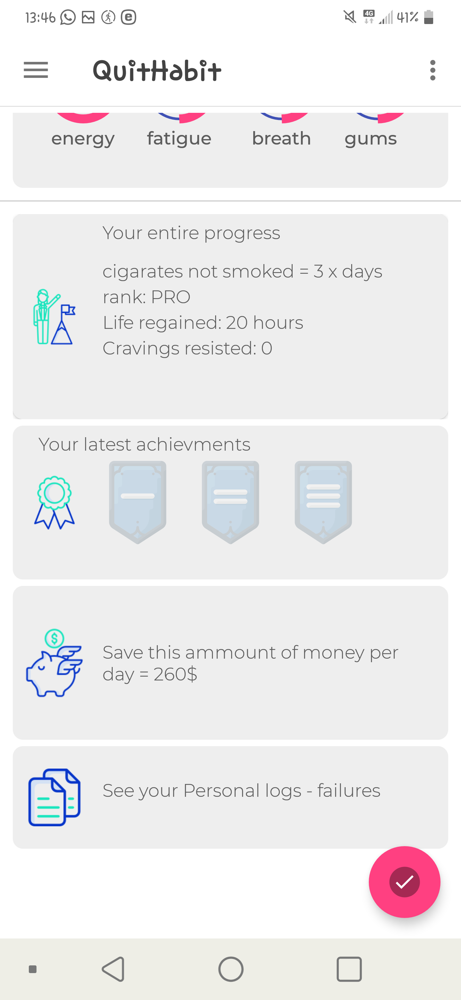

# brainrebootapp

 

 

# Rebootway - the android app to overcome your personal habits

The project is using the following libraries: Butterknife.

## License :scroll: in progress ...

How the app looks right now ... it is a work in progress

//these are the updated images
 

 
//second
 

